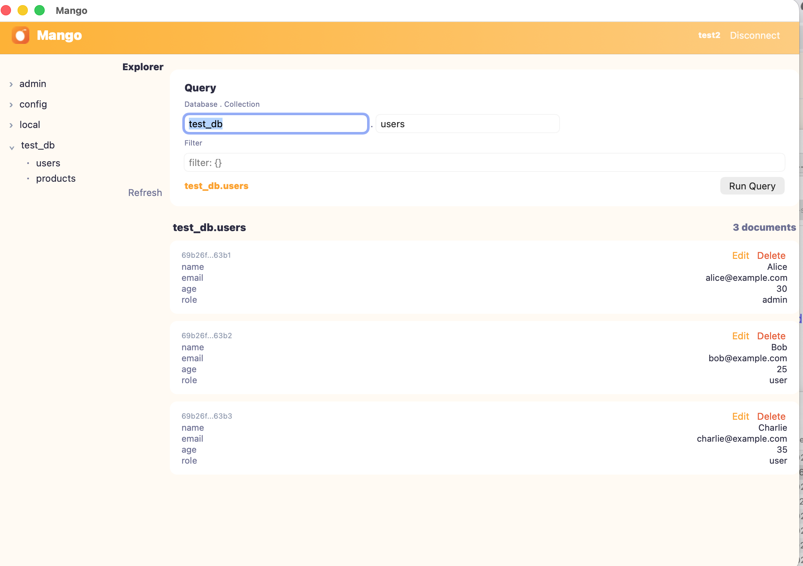
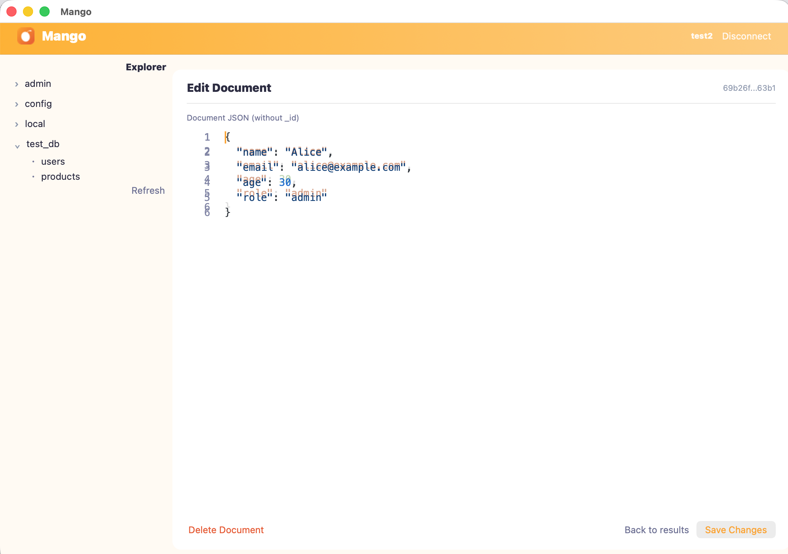

<p align="center">
  
</p>

<h1 align="center">Mango</h1>

<p align="center">
  <strong>A fast, native MongoDB GUI — built with <a href="https://github.com/PerryTS">Perry</a></strong>
</p>

<p align="center">
  <em>MongoDB, finally fast.</em>
</p>

<p align="center">
  
  &nbsp;
  
</p>

---

Mango is a native desktop MongoDB client written in TypeScript and compiled to native ARM64/x86_64 using [Perry](https://github.com/PerryTS). No Electron, no JVM, no runtime overhead — just a small, fast binary that talks directly to your database.

## Features

- **Connection management** — Save, edit, and delete connection profiles. Connect via host/port or full connection string (SCRAM-SHA-256, TLS).
- **Database & collection browser** — Query any collection with custom filters, sort, and projection.
- **Document viewer** — Browse query results as formatted JSON.
- **Document editing** — Edit documents inline and save changes back to MongoDB.
- **Document CRUD** — Insert, update, delete, and duplicate documents.
- **Index listing** — View indexes with key, uniqueness, and size info.
- **Dark & light mode** — Follows system preference automatically.
- **Cross-platform** — Targets macOS (AppKit), iOS (UIKit), Android (Views), Linux (GTK4), Windows (Win32), and the **browser** (WebAssembly + DOM via Perry's `--target web`).

## Getting Started

### Prerequisites

- [Perry](https://github.com/PerryTS) compiler
- [Bun](https://bun.sh) (for type-checking and running tests)
- A running MongoDB instance

### Build

```bash
# Install type-checking dependencies
bun install

# Compile to native binary
perry compile src/app.ts --output mango

# Run
./mango
```

### Run in the browser (WebAssembly)

```bash
# Compile to a single self-contained HTML+WASM file (~4 MB)
perry compile src/app.ts --target web -o dist/mango.html

# Serve over HTTP (file:// won't work — fetch() hits CORS errors)
python3 -m http.server 8765 -d dist
open http://localhost:8765/mango.html
```

The web build is the same source code, compiled by Perry to WebAssembly with a JavaScript bridge that maps every Perry widget to a DOM element. SQLite-backed connection storage degrades to an in-memory transient store on web; the Hone code editor's native bindings degrade to no-ops; and you'll need to point at a Mango Server proxy if you want to talk to MongoDB from the browser. Everything else (UI, navigation, query builder, document viewer, dark/light mode, i18n) works the same as the native builds.

### Development

```bash
# Type-check
perry check

# Run tests
bun test
```

## Project Structure

```
src/
  app.ts                 # Entry point — screens, navigation, UI
  data/
    connection-store.ts  # SQLite CRUD for saved connections
    mongo-client.ts      # MongoDB client wrapper
    preferences.ts       # User preferences (theme, page size, etc.)
    database.ts          # SQLite database helper
  theme/
    colors.ts            # Mango color palette (light/dark)
    typography.ts        # Platform-specific font families
tests/                   # Unit and integration tests
logo/                    # App icons and brand assets
perry.config.ts          # Perry build configuration
perry.toml               # Perry project manifest
```

## How It Works

Perry compiles TypeScript to native machine code via SWC (parsing) and LLVM (codegen). Platform UI is rendered through native frameworks — AppKit on macOS, UIKit on iOS, GTK4 on Linux, etc. MongoDB access uses Perry's built-in `mongodb` package, which wraps the Rust MongoDB driver directly in the compiled binary.

The result is a ~7 MB self-contained binary with sub-100 MB RAM usage and instant cold start.

## License

[MIT](LICENSE) — Skelpo GmbH
